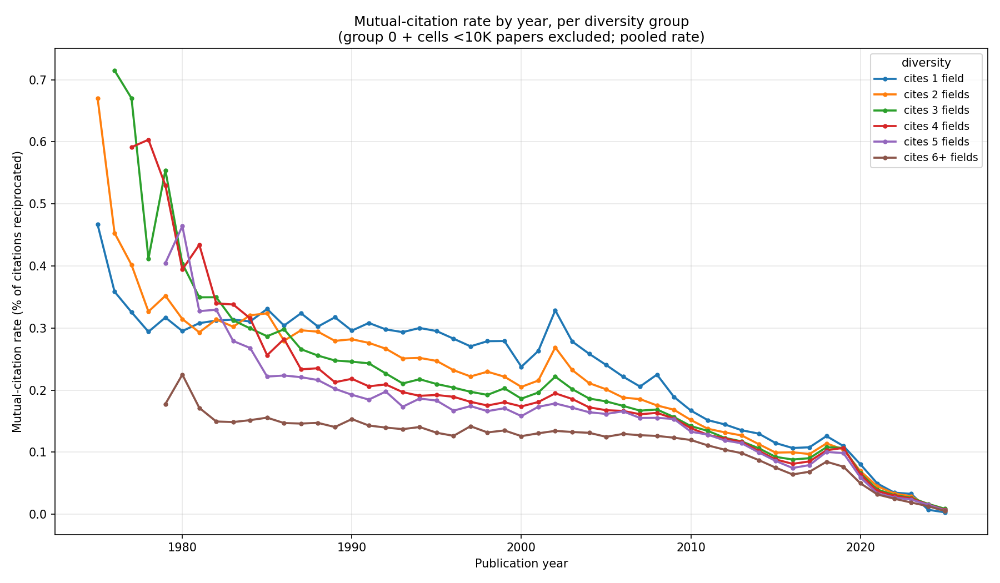
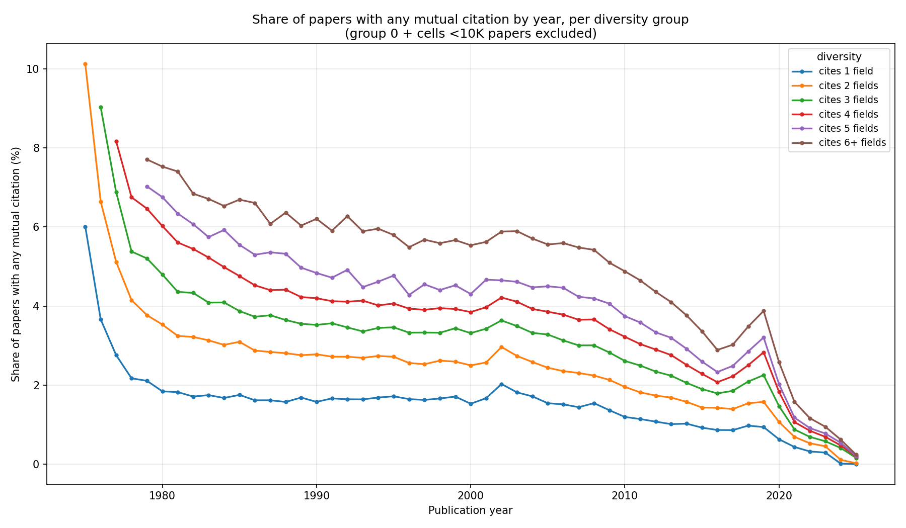
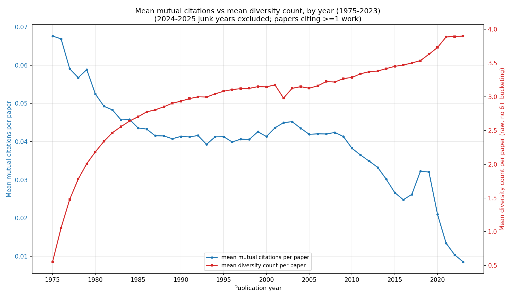

# Mutual Citations & Field Diversity: Graph Summary

## 1. Mutual-citation rate by diversity group

Each individual citation a paper makes is less likely to be returned the more fields that paper cites.

## 2. Share of papers with any mutual citation, by diversity group

More interdisciplinary papers are more likely to receive at least one reciprocated citation. Every diversity group is declining together over time.

## 3. Mean mutual citations vs. mean field diversity over time (1975–2023)

As papers cite more fields over 50 years, the average rate of mutual citation declines.
